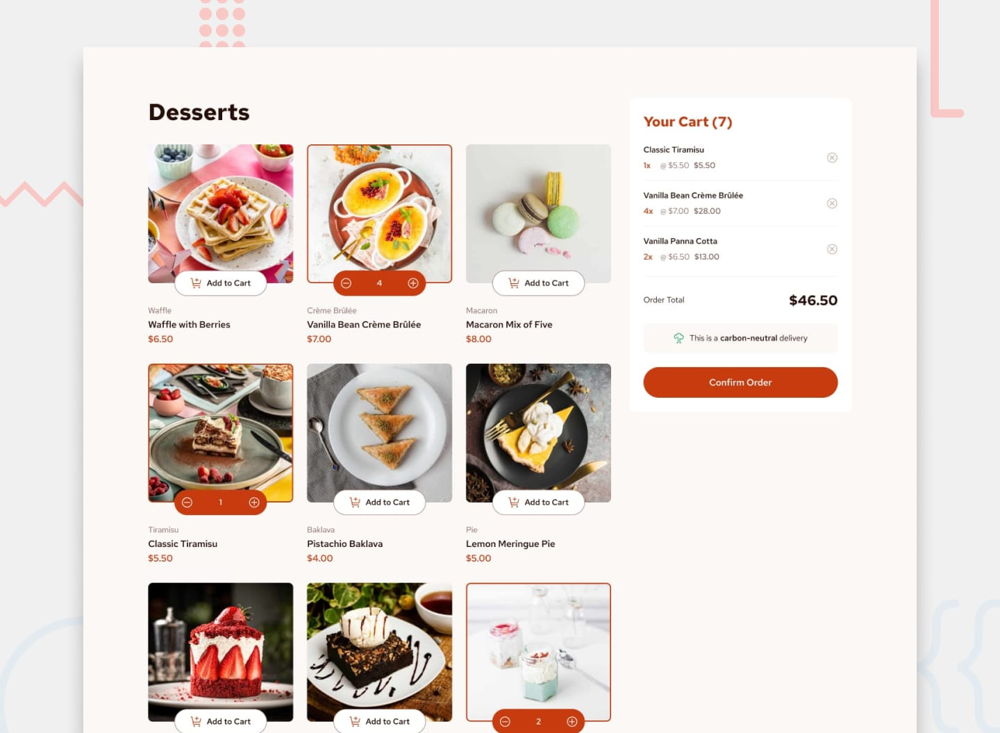

# Frontend Mentor - Product list with cart solution

This is a solution to the [Product list with cart challenge on Frontend Mentor](https://www.frontendmentor.io/challenges/product-list-with-cart-5MmqLVAp_d). Frontend Mentor challenges help you improve your coding skills by building realistic projects. 

## Table of contents

- [Overview](#overview)
  - [The challenge](#the-challenge)
  - [Screenshot](#screenshot)
  - [Links](#links)
  - [Built with](#built-with)
  - [Useful resources](#useful-resources)

## Overview

### The challenge

Users should be able to:

- Add items to the cart and remove them
- Increase/decrease the number of items in the cart
- See an order confirmation modal when they click "Confirm Order"
- Reset their selections when they click "Start New Order"
- View the optimal layout for the interface depending on their device's screen size
- See hover and focus states for all interactive elements on the page

### Screenshot

### Links

- Live Site URL: [here](https://product-list-with-cart-ten-livid.vercel.app/)

### Built with

- [React](https://reactjs.org/) - JS library
- [Next.js](https://nextjs.org/) - React framework
- [Tailwind](https://tailwindcss.com/) - Tailwind CSS Framework

### Useful resources

- [Scroll-to-Top](https://www.geeksforgeeks.org/create-animated-scroll-to-top-button-in-tailwind-css/) - Create Animated Scroll to Top in Tailwind CSS
- [Changing value of context from child component](https://stackoverflow.com/questions/74553077/is-there-a-way-of-changing-the-usecontext-value-in-a-child-so-the-other-childs-g)
- [Update value of context](https://stackoverflow.com/questions/73101274/how-to-update-react-context-from-multiple-conmponents)
- [Null-safe](https://stackoverflow.com/questions/32139078/null-safe-property-access-conditional-assignment-in-ecmascript-6)
- [Sum a property value](https://stackoverflow.com/questions/23247859/better-way-to-sum-a-property-value-in-an-array)